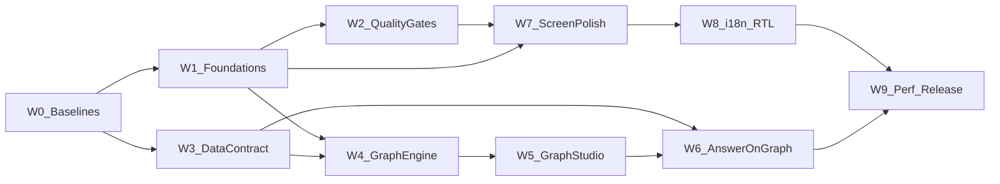

# 10 — Implementation plan (Waves W0–W9)

Parent: [README](README.md) · Laws: [01](01-first-principles.md) · ECs: [09](09-edge-cases.md) · Next: [11-e2e-test-matrix](11-e2e-test-matrix.md)

## Dependency graph

## Wave 0 — Baselines (docs done; exec next)

**Goal:** Fresh evidence vs v0.28.5.

- Mocked-API Playwright capture of all routes × light/dark × 375/768/1280 →
  `specs/155-improve-ux-ui/baselines/` (or `audit_ui/155/`).
- axe JSON dump; locale-parity report; Lighthouse spot on `/` and `/graph`.
- Graph fixture generators checked in.

**DoD:** Baseline artefacts committed; T04 addressed going forward.  
**Risk:** Backend down — mock-only is fine.  
**Rollback:** N/A (docs/artefacts).

## Wave 1 — Foundations

**Goal:** LAW-155-1,2,6,9 (partial),13 quick wins.

- Font fix (Geist); semantic tokens; focus SSOT.
- `PageShell` / `PageHeader` / `StatusBadge` / formatters; wire EmptyState.
- Dead-code purge (verified `rg` imports); remove `@react-sigma` deps.
- Command palette **or** remove Cmd+K from help; single shortcuts listener.
- `not-found` / humanised errors; login autocomplete; language switch fix;
  `html lang`; breadcrumb paths; 12px floor migration on shell.

**DoD:** Gates 40,41,44–47,49,60,70,71 green; D01/D02/S01/S02/S05/I01/I02 closed.  
**Risk:** Visual churn — review with UX lens.  
**Rollback:** Revert token PR; keep font fix if isolated.

## Wave 2 — Quality gates

**Goal:** LAW-155-14 infrastructure.

- axe / visual / reduced-motion / forced-colors projects.
- locale-parity CI; eslint type-floor + palette allow-list.
- vitest jsdom project.

**DoD:** 42,43,72(partial),74,76,77 green on main.  
**Risk:** Flaky screenshots — mask dynamic clocks/versions.  
**Rollback:** Disable visual project if flake; keep axe.

## Wave 3 — Data contract (cheap)

**Goal:** LAW-155-10,11 (API half); F-155-B01–B07,B09.

- Implement [08-data-contract](08-data-contract.md) cheap table.
- OpenAPI refresh + WebUI types.
- Cargo e2e 80–86.

**DoD:** All cargo gates green; no cross-tenant total leak.  
**Risk:** Count performance — cache or stats row if slow.  
**Rollback:** Feature-flag new fields; keep old bare `degree` number.

## Wave 4 — GraphEngine

**Goal:** LAW-155-3,4,6,8,12 correctness.

- Extract Engine; MultiGraph; fix truncation, time filter, export, minimap,
  camera, keyboard, WebGL fallback; debounce filters; store selectors.
- Split god files; sigma 3.0.3; `@sigma/export-image`; drop dead tests’ false
  worker claims or implement worker.

**DoD:** EC 01–05,07–08,11–15,25–27,30 green; G01–G11,G18 closed.  
**Risk:** Behavioural regressions — keep graph-responsive suite.  
**Rollback:** Engine behind flag; old renderer path one release.

## Wave 5 — Graph Studio features

**Goal:** LAW-155-5.

- Dim focus, LOD, hulls+legend, ego, path, lasso, saved views, table alt,
  colour-blind shapes, worker FA2 polish.

**DoD:** EC 06,09–10,16–20,31 green; G12–G14,G17 closed.  
**Risk:** Hull perf — simplify to disks if needed.  
**Rollback:** Feature flags per mode.

## Wave 6 — Answer-on-graph

**Goal:** LAW-155-11 UI.

- Highlight layer; Show on graph; deep link; consume W3 ids.

**DoD:** EC 65 green; Q05 closed.  
**Risk:** Name collisions — prefer graph_node_id.  
**Rollback:** Hide button if subgraph absent.

## Wave 7 — Screen polish

**Goal:** LAW-155-2,7 across routes.

- Implement [07-screens-spec](07-screens-spec.md) W7 rows; Costs honesty;
  w-slug shell DRY; Query IME/stream; Docs SRP; Pipeline poller; Settings nav;
  ConnectionIndicator global.

**DoD:** EC 48,51–59,61–63,75 green; P* / Q01–04 closed.  
**Risk:** Large PR — split by route.  
**Rollback:** Per-route reverts.

## Wave 8 — i18n + RTL prep

**Goal:** LAW-155-9.

- Fill en/fr/zh; remove inline-default debt gradually; Intl + date-fns locales;
  logical properties migration on shell + top offenders.

**DoD:** locale_parity 100%; EC 72–73 green; I03–I05 closed.  
**Risk:** String length in DE/FR layouts — visual check.  
**Rollback:** Partial locale commits ok.

## Wave 9 — Perf & release

**Goal:** LAW-155-12.

- Dynamic import audit; optional React Compiler trial; SSR shell experiment;
  Web Vitals CI; wire gates into `make release-gates`; CHANGELOG; docs.

**DoD:** Budgets met; release checklist updated.  
**Risk:** Compiler breaks — keep opt-in.  
**Rollback:** Disable compiler.

## SOLID / DRY checklist per wave

- [ ] No new formatCost / statusConfig copies
- [ ] No Sigma.init outside GraphEngine (W4+)
- [ ] No second layout for w-slug
- [ ] Files touched ≤500 lines (prefer ≤300)
- [ ] Every closed finding lists EC + gate in PR body

## Staffing suggestion

| Wave | Primary lenses |
|------|----------------|
| W1–W2 | Front, UX |
| W3 | Database, Full stack |
| W4–W5 | Front, Full stack, UX |
| W6 | AI Engineer, Front |
| W7 | UX, Front, Product |
| W8–W9 | Front, Full stack, Product |

Cross-ref: [12-cross-ref](12-cross-ref.md) · [LENS-product-owner](lenses/LENS-product-owner.md).
